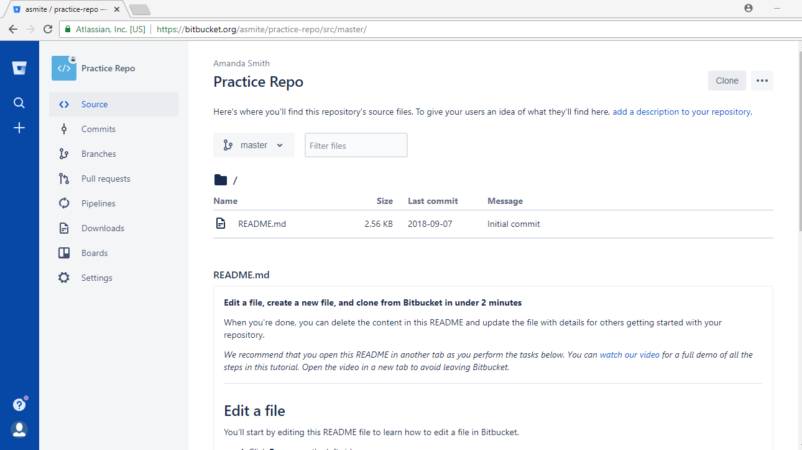

# Introduction
This document goes over how to use Git commands, and will aid in understanding the basic workflow process. This includes:
* [Really really short summary](#H0)
* [Overall View of Workflow](#H1)
* [Review of Cloning](#H2)
* [Adding, Committing, and Pushing](#H3)
* [Error Handling in the Streamline Process](#H4)
* [Pulling](#H5)

This is the second document in my series of tutorials. To view the first one, [check it out here](https://github.com/amsmite001/tutorials-csci/blob/master/Bitbucket_Tutorials/Bitbucket_IntroREADME.md)!

---
## <a name = "H0"></a> Really Really Short Summary
When you're ready to push to Github/Bitbucket, run
```
git add --all
git commit -m [provide a SHORT message]
git push
```

---
## <a name = "H1"></a>Workflow
A basic representation of Git's workflow is as pictured:


In the previous tutorial, we walked through the first two steps: How to create a repository and how to clone it to your computer. The next step is to work on the files you cloned. This may include making new files or editing the ones that already exist. After you finish working for the day, you want to push your changes _upstream_.

<b>_Upstream?_</b> When we talk about upstream, we mean that we're going to push all of our changes into Bitbucket - the top of the stream. The headlines are what entails pushing upstream.

Why would we want to use this workflow process?
* __Save Rollbacks:__ If you make a change to your code that entirely breaks it, with little hope of saving it, Bitbucket/Github makes it possible to roll your code back to the any of the last versions that you pushed upstream.

* __Progress Tracking__ Github and Bitbucket provide time stamps, and other information about the code you push to the repo. Time stamps makes grading easier for professors, as they can look at the last, on-time version of code that you added. You can also see your own stats, as well as any group members.

* __Offsite Saving__ Repos are like Dropbox or OneDrive - they can save your files for you, safely. No more of the "my computer crashed and deleted everything" excuse.
    * If you're wanting to use that excuse, maybe you shouldn't use this?

---
## <a name = "H2"></a> Review of Cloning


1. Select __Clone__ from the base directory/folder of a repo. (Top right of screen)
2. Navigate your terminal to the place you want to save it.
    * For example, if I wanted to save the repo to a folder on my home screen, I would run:
        ```
        cd /mnt/c/Users/AmandaComputer/Desktop/ExampleFolder
        ```
        Then, after you hit enter, paste the command you copied earlier. This will now clone the repo into the folder.

---
## <a name = "H3"></a> Adding, Committing, and Pushing


We've completed the first 3 steps so far of the workflow process. (I'm assuming that you've done some work to satisfy step 3.) The next steps are to:
* [Add](#Add)
* [Commit](#Commit)
* [Push](#Push)

To see what files have been changed/added, you can run `git status`.
* _Status_ shows what branch you're on, as well as any files that have been changed.


_Note: All of the following must be completed, and in order, to be able to see your work in Github/Bitbucket.__ 
1. <a name = "Add"></a> __Add__ the work you've done to the stream. 
    ```
    git add [filename]
    ```
    You can also add everything at once with:
    ```
    git add --all
    ```
-------

2. <a name = "Commit"></a>__Commit__ the work that you've added. There are several ways to do this:
    ```
    git commit -m [message for commit]
    ```
    Or,
    ```
    git commit
    ```
    The latter will bring you to an in-console editor like vim/vi or nano. (Click on the picture to full size)
    


    * To exit from __nano__, press __ctrl + x__, type __y__, then press __enter__.
    * To exit from __vi or vim__, press __!__, then type `:wq` (which is quit with save). 
        * If you mess up and don't want to save, type `:q!` instead.

    __What is a commit message?__ A one line statement about what work you did. This will be the line of text that shows up next to the folder in Bitbucket. Make it professional - anyone who is apart of the project can see what's typed for your past commits!

-------

3. <a name = "Push"></a>__Push__ changes up to Bitbucket.
    ```
    git push
    ```
    * Theoretically, if they sshkeys are done right, Bitbucket/Github shouldn't ask you for a password. I haven't had any luck with this bit with Bitbucket, and it always asks for a password.

_Now, after all of these steps have been completed_ you can go into your repository in Bitbucket/Github and view your updated files. You'll notice that beside each filename is the short message you typed in earlier!

---
## <a name = "H4"></a> Error Handling in the Streamline Process 

Git is very picky about many things, and sometimes it's very difficult to get working.

If all else fails, the best thing about Bitbucket/Github is that you can just delete all of the files off of your computer, and re-clone the repo to start again. (A "burn everything and restart" method.)

### Status/Add Errors:
* <details><summary><i>fatal: Not a git repository (or any parent up to mount point /home) Stopping at filesystem boundary (GIT_DISCOVERY_ACROSS_FILESYSTEM not set).</i> </summary>
    <p>
    In order to use Git, you __must be in__ the repository that has been cloned from Github/Bitbucket. Navigate inside of the correct repo to resolve the error. 
    
    For example, I would get the error here:
    ```
    /mnt/c/Amanda/Documents
    ```

    But not here:
    
    ```
    /mnt/c/Amanda/Documents/MyRepo
    ```
    </p>
    </details>
### Commit Errors:
* <details><summary><i>"Who are you?"</i></summary>
    <p>
    Git doesn't know your login to push to. It provides the commands to fix this issue:

    ```
    git config --global user.email "you@example.com"
    git config --global user.name "Your Name"
    ```
    For example, mine would look like:
    ```
    git config --global user.email "myemail@domain.com"
    git config --global user.name "amsmite001"
    ```
    This should resolve the issue.
    </p>
    </details>
---
## <a name = "H5"></a> Pulling
Pulling is required in unique situations. If there have been changes made in another source besides your computer, then you need to pull the changes down from Github/Bitbucket.

Situations that might require `git pull`:
* Group projects
* Working on a solo project from multiple computers
* Edited a file online through the website

You will notice when running `git status` that your commit is some number of commits _behind_. (It will tell you this in the commandline). In order to catch up, you will need to run __from inside the correct repo_   
```
git pull
```

__WARNING:__ If you decide to ignore this and edit without pulling, you are highly likely to run into a merge conflict. Proceed at your own risk.

After this step, you are free to continue working as you would have.

---


This document is property of Amanda Smith. Redistribution is permitted with permission. If there are any issues/questions with this doucment, create a ticket and I will get to it as fast as I can.

Document #2/?