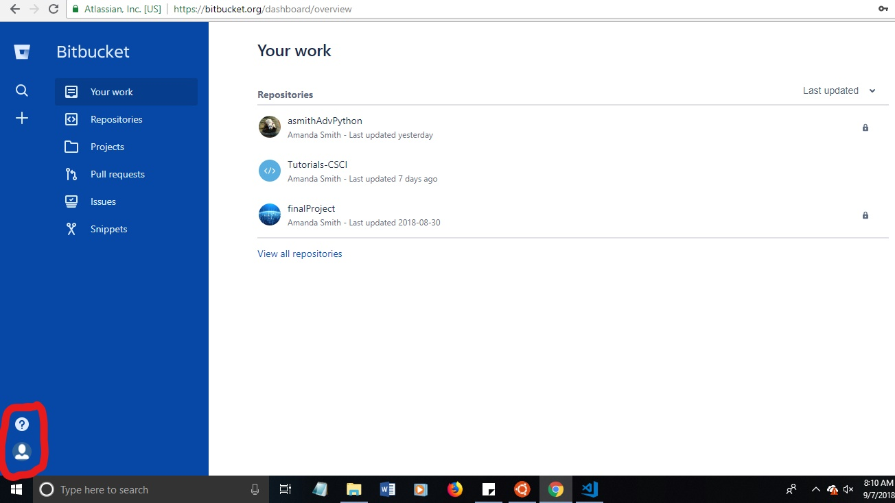

# Introduction
This document walks through how to set up a Bitbucket account including:
* [Creating an Account](#H1)
* [Adding SSH keys](#H2)
* [Adding a repository](#H3)
* [Cloning the repository](#H4)


What is Bitbucket? Bitbucket is an enterprise solution to Github. It is code management with extra features that businesses can use.

---
## <a name = "H1"></a>Creating an Account
It's highly recommended to use your school email to create an account.
* Go to: https://bitbucket.org/ 
    * If you already have an account, log in. If not, click __Get started__ and follow the prompts.
    * You'll want to use your school email to get some additional perks with your account that you'd normally have to pay for.
* _Once you've logged in:_ You'll be brought to your home screen.
    * You can see all of your repositories from here, or by clicking __Repositories__ on the left hand side of the blue bar. (As seen below.)

---
## <a name = "H2"></a>Creating Repositories
A repository is an area that you can store like projects. For example, the repo (repository) that this document comes from is full of documents on tutorials. I have repo's for classes and for individual projects.

1. _To create a new repo_, click the `+` button from the left hand bar. Click __Repository__.

2. _Give it a name._ This is the name that will show up as a folder once you copy it. It's also the name that the world can see!

3. If you want the repo to be private, _leave __Access Level__ checked._ If you'd like it open for anyone to view - like this repo, uncheck it.

4. Ignore the _README_ option.

5. Version Control: Git.

6. You're done! Click __Create Repository__ button to finish!


With the student option (that you get automatically by using your CMU email) you can have a large (?) number of repos. Repos are not language limited and can hold a variety of file types (even if Git/Bit can't open them via the website).

__Advanced: Optional__

If you want to learn about how work environments use Bit/Git, under the advanced options, check the _Issue Tracking_ option under _Project Management_. Then, head over to the __Advanced Workflow Tutorial__ document to learn how to use issues.

Good practice also suggests you give it a description, but this can be added later with the README.

---
## <a name = "H3"></a>Adding SSH Keys
__What are SSH Keys?__

 SSH keys help prevent man in the middle attacks, and allow you to connect to Github/Bitbucket without the use of a username and password (though the password option is flakey, and will most likely still ask for it).

<i>Note:</i> Adding 2-factor authentication will make login via the console very difficult. While it's less secure, I'd recommend not using 2-factor.

__How to add a SSH Key__
Start on the homepage of Bitbucket (the steps are the similar for Github as well).



1. Select your icon in the lower left-hand side of the screen.
2. Select __Bitbucket Settings__
3. From the center column, near the bottom is __SSH keys__
4. Select __Add Key__

Now, open a terminal, using one of the following: WSL, Linux Terminal, Gitbash, MacOS terminal.
1. Open one of the following listed above. [Git Definition Link](https://confluence.atlassian.com/x/X4FmKw) 
Enter:

    ```
    ssh-keygen
    ```
    The default save locations are okay. _Hit enter for any question it prompts._ It'll look like:

    ```
    Generating public/private rsa key pair.
    Enter file in which to save the key (/home/[Username]/.ssh/id_rsa):
    Enter passphrase (empty for no passphrase):
    Enter same passphrase again:
    Your identification has been saved in /home/[Username]/.ssh/id_rsa.
    Your public key has been saved in /home/[Username]/.ssh/id_rsa.pub.
    The key fingerprint is:
    SHA256:ehzT56yTQ80w7jssxAUvb+iQGcsVs5bGm+S+rxFcw7o [User]@[User]
    The key's randomart image is:
    +---[RSA 2048]----+
    |                 |
    |        +.       |
    |       . B+      |
    |      ..X+=.     |
    |     . %SO.=.    |
    |      *oB==+o    |
    |      .=E= .o    |
    |       .+.B.     |
    |        o=+=     |
    +----[SHA256]-----+
    ```
2. Start the ssh agent.

    * <details><summary>Windows and Linux:</summary>
        <p>

        ```
        eval $(ssh-agent) 
        ```
        </p>
        </details>
        
    * <details><summary>MacOS:</summary>
        <p>

        ```
        eval `ssh-agent`
        ```
        </p>
        </details>

3. Add the ssh key:
    * <details><summary>Windows and Linux:</summary>
        <p>

        ```
        ssh-add ~/.ssh/<private_key_file> 
        ```
        </p>
        </details>
    * <details><summary>MacOS:</summary>
        <p>

        ```
        ssh-add -K ~/.ssh/<private_key_file> 
        ```
        </p>
        </details>
    For example, for Windows and Linux it will be:
    ```
    ssh-add ~/.ssh/id_rsa.pub
    ```
    _Note: If you get an unprotected key file warning, it's okay to ignore it._
4. Add the key to Bitbucket.
    * Run `cat ~/.ssh/id_rsa.pub`

    * Copy the text that appears (highlight and then right click or ctrl + c)
        ```
        ssh-rsa
        (The id of your key, in the form of random characters) [user][@user]
        ```
        * Make sure you copy all of the text. Otherwise, Bitbucket will say your key is invalid.

    * Head back over to the tab you opened earlier (Bitbucket's `Add Key` option). Paste the key into the corresponding spot.
        * You can call the device whatever you'd like. It help to name it something that you'll be able to recognize in case you need to view it later.
    
    * Click __Save__

    * Lastly, back in the terminal (black window we were typing in earlier), enter `ssh -T git@bitbucket.org`. This will add the key.

Now you're all set and ready to get going! If you get an error in any step, recheck that you typed everything correctly. The most error you should get is if you copy and paste the key wrong.

---
## <a name = "H4"></a>Cloning the Repository

There are a couple of ways to clone a repository. I'll go over the easiest ways.

__What does it mean to 'clone' a repository?__

Cloning just copies the documents you see in the Bitbucket/Github project to your computer. It doesn't change the work that's done, so you can clone as many times as you want!

### Version 1


1. Select __Clone__ from the base directory/folder of a repo. (Top right of screen)
2. Navigate your terminal to the place you want to save it.
    * For example, if I wanted to save the repo to a folder on my home screen, I would run:
        ```
        cd /mnt/c/Users/AmandaComputer/Desktop/ExampleFolder
        ```
        Then, after you hit enter, paste the command you copied earlier. This will now clone the repo into the folder.

### Version 2
TODO :)
